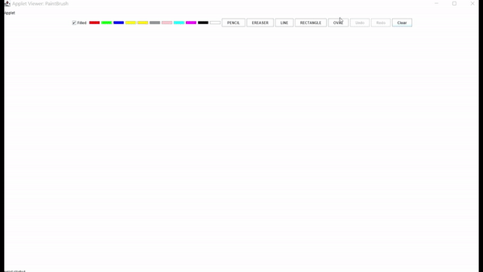

# PaintBrush-JavaApplet

The Desktop Paint App is a feature-rich drawing application that provides users with a wide range of tools to unleash their creativity. This app supports various features, including freehand drawing, shapes, colors, an eraser, undo and redo functionality, and the ability to clear the canvas.

## Features

1. **Colors:** Choose from a diverse palette of colors to add vibrancy and life to your drawings.

2. **Freehand Drawing:** Express your creativity freely with the freehand drawing tool. Use your mouse or input device to draw anything you imagine.

3. **Eraser:** Correct mistakes or remove unwanted parts of your drawing with the eraser tool. Fine-tune your artwork easily.

4. **Shapes:** Create geometric shapes like rectangles and ovals with precision. Choose between filled and outlined versions of shapes.

5. **Undo and Redo:** Easily correct or revert changes with the undo and redo functionality. Experiment with your design knowing that you can always go back.

6. **Clear Canvas:** Start fresh by clearing the entire canvas. This feature allows you to wipe the slate clean and begin a new masterpiece.

## **Demo:**




## Requirements

To run the Desktop Paint App, ensure that you have Java 8 or above installed on your desktop.

## How to Run the App

Follow these steps to run the Desktop Paint App:

1. **Navigate to the Project Directory:**
   Open a terminal and navigate to the directory where the Desktop Paint App is located.

   ```bash
   cd path/to/desktop-paint-app
   ```

2. **Compile the Java Code:**
   Compile the Java code using the following command:

   ```bash
   javac Main.java
   ```

3. **Run the Applet Viewer:**
   Launch the app using the applet viewer with the following command:

   ```bash
   appletviewer paintBrush.html
   ```

   The applet viewer will open, and you can start using the Desktop Paint App to create beautiful artworks.

## License

This Desktop Paint App is released under the [MIT License](LICENSE). Feel free to explore, modify, and share the app according to the terms of the license.
